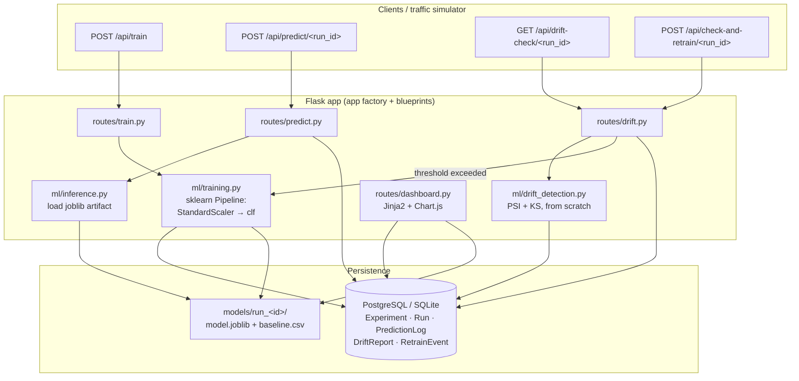

# ModelWatch

**An ML model monitoring & drift-detection platform.** Train a classifier, serve
predictions, log every scored request, and continuously compare the live input
distribution against the training baseline. When too much of the feature space
drifts, ModelWatch retrains the model automatically and records why.

---

## 1. The problem this solves

A model is trained once on a snapshot of the world and then deployed for months.
The world does not hold still: customer behaviour changes, an upstream sensor is
recalibrated, a data pipeline starts formatting a field differently, a marketing
push changes who shows up. The model keeps returning confident predictions the
whole time — there is no exception, no stack trace — but its accuracy quietly
decays because the data it now sees no longer looks like the data it learned
from. This is **data drift** (the input distribution `P(X)` moves) and
**concept drift** (the relationship `P(y | X)` moves).

ModelWatch makes that decay observable and acts on it:

- every prediction request is logged with its feature values and a timestamp;
- on demand (or on a schedule you drive), the recent window of live inputs is
  compared feature-by-feature against the exact data the model trained on, using
  two standard statistical tests (**PSI** and the **Kolmogorov–Smirnov test**);
- each feature gets a drift score and a severity band (stable / moderate /
  significant);
- if the fraction of significantly-drifted features crosses a threshold, a new
  model is trained on recent labelled production data and a `RetrainEvent`
  audit row is written.

---

## 2. Architecture



Text version of the same flow:

```
train  ──▶ training.py ──▶ fit Pipeline(StandardScaler, LogisticRegression|RandomForest)
                          ├─▶ models/run_<id>/model.joblib   (pipeline + feature list)
                          ├─▶ models/run_<id>/baseline.csv   (exact training feature rows)
                          └─▶ DB: Experiment + Run(metrics, artifact_path)

predict ─▶ inference.py ─▶ load artifact, align columns, predict + predict_proba
                          └─▶ DB: PredictionLog(input_features, prediction, proba, ts)

drift-check ─▶ drift_detection.py
                 recent N PredictionLogs  vs  models/run_<id>/baseline.csv
                 per feature: PSI + KS  ─▶ DB: DriftReport(per feature, severity)

check-and-retrain ─▶ run drift-check; if (#significant / #checked) > fraction:
                       train new Run on recent labelled PredictionLogs
                       └─▶ DB: RetrainEvent(reason, drift_summary, new_run_id)

dashboard ─▶ HTML + Chart.js reading the tables above
```

### Data model

| Table              | Purpose | Key columns |
|--------------------|---------|-------------|
| `experiments`      | A modelling problem definition | `model_name`, `model_type`, `hyperparams`, `feature_columns`, `target_column` |
| `runs`             | One training run of an experiment | `experiment_id`→, `metrics` (accuracy/precision/recall/f1/auc), `train_duration_seconds`, `model_artifact_path`, `status` (pending/running/completed/failed) |
| `prediction_logs`  | One scored inference row | `run_id`→, `input_features`, `prediction`, `prediction_proba`, `actual_label`, `timestamp` |
| `drift_reports`    | One feature's drift test at a point in time | `run_id`→, `feature_name`, `test_statistic`, `p_value`, `drift_score` (PSI), `drift_detected`, `severity`, `method`, `window_start/end` |
| `retrain_events`   | Audit of an auto-retrain decision | `run_id`→ (monitored), `triggered_by`, `reason`, `drift_summary`, `new_run_id`→ |

Relationships: `Experiment 1─* Run 1─* PredictionLog`, `Run 1─* DriftReport`,
`Run 1─* RetrainEvent`. Timestamp and foreign-key columns are indexed.

---

## 3. The math: PSI and the KS test

Both tests compare a **baseline** sample (the feature values the model trained on)
with a **current** sample (recent production values for that feature). They are
computed from scratch in [`app/ml/drift_detection.py`](app/ml/drift_detection.py).

### Population Stability Index (PSI)

PSI asks: *how much probability mass moved between bins?*

1. Cut the baseline into **10 bins** using its deciles as edges, so each baseline
   bin holds ≈ 10 % of the baseline rows. The outer edges are set to ±∞ so
   out-of-range current values still fall in the first/last bin.
2. For each bin *i*, take the share of each sample that lands in it:
   `E_i` = baseline fraction, `A_i` = current fraction.
3. Sum the per-bin contributions:

$$
\mathrm{PSI} = \sum_{i=1}^{B} (A_i - E_i)\,\ln\!\left(\frac{A_i}{E_i}\right)
$$

Each term multiplies **how much the bin's share changed** (`A_i − E_i`) by the
**log ratio of the shares** (`ln(A_i / E_i)`). Empty bins are floored to a tiny
`ε` so the log and division stay finite. PSI is ≥ 0, and it is (near-)symmetric:
swapping baseline and current gives a similar value.

Industry-standard interpretation (from credit-risk scorecards), used here as the
severity bands:

| PSI              | Meaning              | Severity      |
|------------------|----------------------|---------------|
| `< 0.10`         | no significant shift | `stable`      |
| `0.10 – 0.20`    | moderate shift, watch| `moderate`    |
| `> 0.20`         | major shift, act     | `significant` |

### Kolmogorov–Smirnov two-sample test

The KS test asks: *could these two samples plausibly come from the same
distribution?* It works on the **empirical cumulative distribution functions**
(ECDFs) — the step function `F(x)` = fraction of sample points ≤ `x`.

The statistic is the largest vertical gap between the two ECDFs:

$$
D = \sup_x \; \bigl| F_{\text{baseline}}(x) - F_{\text{current}}(x) \bigr|
$$

Under the null hypothesis "same distribution", `D` scaled by
`sqrt(n·m / (n+m))` (with sample sizes `n`, `m`) follows the Kolmogorov
distribution, which converts `D` into a **p-value**. A small p-value means a gap
that large would almost never happen by sampling luck alone, so the
distributions differ. We use `scipy.stats.ks_2samp` for the exact p-value; the
statistic `D` is the sup-gap defined above. Threshold: **p < 0.05 ⇒ drift**.

Unlike a mean comparison, KS also catches **variance-only** and shape changes
where the mean is unchanged.

### Combining them

`compare_distributions(baseline_df, current_df, features)` runs both tests per
feature and sets `drift_detected = (PSI > 0.20) or (KS p-value < 0.05)`. A feature
is `significant` when its PSI band is `significant`. The auto-retrain policy fires
when `significant_features / features_checked` exceeds `RETRAIN_DRIFT_FRACTION`
(default `0.30`).

> **Sample-size note.** PSI over 10 deciles and KS across many features are noisy
> on very small windows (e.g. a single 50-row batch will over-report drift). The
> `/api/drift-check` endpoint uses a rolling window of the last
> `DRIFT_WINDOW_SIZE` predictions (default 300) to keep the numbers stable.

---

## 4. Setup

Requires **Python 3.10+**. PostgreSQL is optional — without it the app uses a
local SQLite file.

```bash
git clone <this-repo> && cd modelwatch

python -m venv .venv
source .venv/bin/activate            # Windows: .venv\Scripts\activate

pip install -r requirements.txt      # runtime deps
pip install -r requirements-dev.txt  # + pytest, for the test suite

cp .env.example .env                 # optional; every value has a default
```

### Environment variables

All optional. See [`.env.example`](.env.example) for the full list.

| Var | Default | Meaning |
|-----|---------|---------|
| `DATABASE_URL` | *(unset → SQLite at `data/modelwatch.db`)* | PostgreSQL URL; a legacy `postgres://` scheme is rewritten to `postgresql://` |
| `FLASK_CONFIG` | `development` | `development` \| `production` \| `testing` |
| `SECRET_KEY` | `dev-secret-change-me` | set in production |
| `PSI_STABLE_MAX` / `PSI_MODERATE_MAX` | `0.1` / `0.2` | PSI severity band edges |
| `KS_P_VALUE_THRESHOLD` | `0.05` | KS p-value below this flags drift |
| `DRIFT_WINDOW_SIZE` | `300` | recent predictions compared to baseline |
| `RETRAIN_DRIFT_FRACTION` | `0.30` | retrain if > this fraction of features drift significantly |
| `TEST_SIZE` / `RANDOM_STATE` | `0.2` / `42` | held-out split for training |

### Database & migrations

Flask-Migrate (Alembic) manages the schema. The `migrations/` folder and the
initial migration are already committed, so:

```bash
export FLASK_APP=run.py              # already set in .flaskenv

# PostgreSQL only: create the database first, e.g.
#   createdb modelwatch
#   export DATABASE_URL=postgresql://localhost:5432/modelwatch

flask db upgrade                     # create all tables at the latest revision
```

Changing a model later:

```bash
flask db migrate -m "describe change"   # autogenerate a revision
flask db upgrade                        # apply it
```

### Run the app

```bash
python run.py                        # http://127.0.0.1:5000
# or
flask --app run run --debug
# or (production)
gunicorn "run:app" --bind 0.0.0.0:8000
```

Health check:

```bash
curl -s localhost:5000/health
# {"status":"ok","service":"modelwatch","database":"ok"}
```

Open `http://127.0.0.1:5000/` for the landing page and
`http://127.0.0.1:5000/dashboard` for the monitoring dashboard.

### Tests

```bash
pytest -q
```

Covers the PSI/KS math on synthetic drift / no-drift cases and the
train → predict → drift-check → auto-retrain API path (SQLite in-memory, no
network).

---

## 5. Run the end-to-end demo

One script drives the whole story in **well under two minutes**, narrating each
step to the console so you can talk over it while screen-recording:

```bash
./scripts/run_demo.sh
# or:  python scripts/demo.py --port 5057 --delay 0.15
```

It will:

1. **reset the database** (drop + recreate all tables);
2. **regenerate** the baseline dataset and a 12-batch "production stream" with
   gradual drift deliberately injected into 12 of 30 features
   ([`app/ml/data_simulation.py`](app/ml/data_simulation.py) documents exactly
   which features and how);
3. **launch** the Flask server;
4. **train** an initial `LogisticRegression` on the clean baseline;
5. **replay** the batches through `POST /api/predict/<run_id>`, showing the
   rolling accuracy decay as drift ramps up;
6. **call the drift check** after every third batch;
7. **fire the auto-retrain** once the significant-drift fraction crosses 0.30
   (around batch 9), then serve traffic from the new model and print the
   `RetrainEvent` log.

To replay traffic manually against a running server:

```bash
python -m app.ml.data_simulation                       # (re)build data/stream/*
python -m app.ml.simulate_traffic --run-id 1 --speed normal --drift-check-every 3
```

`--speed slow|normal|fast|instant` or `--delay <seconds>` controls pacing.

---

## 6. API reference

Base URL `http://127.0.0.1:5000`. All request/response bodies are JSON.

### Training

| Method & path | Body | Returns |
|---|---|---|
| `POST /api/train` | `{"model_type": "logistic_regression" \| "random_forest", "model_name"?, "hyperparams"?: {}, "baseline_csv"?, "feature_columns"?: [], "target_column"?, "notes"?}` | `201` `{run_id, experiment_id, status, metrics, train_duration_seconds, n_training_rows, model_artifact_path}` |
| `GET /api/runs` | – | `{runs: [...], count}` |
| `GET /api/runs/<run_id>` | – | run detail |
| `GET /api/experiments` | – | `{experiments: [...], count}` |

`hyperparams` is merged over the model's defaults. If `baseline_csv` is omitted,
`data/baseline/baseline.csv` is used; feature columns default to every numeric
column except the target.

### Inference

| Method & path | Body | Returns |
|---|---|---|
| `POST /api/predict/<run_id>` | a single feature object, or `{"features": {...} \| [ {...} ]}`, or `{"records": [ {...} ], "actual_labels"?: [0,1,...]}` | `{run_id, predictions: [...], probabilities: [...], logged: N}` |
| `GET /api/predictions/<run_id>` | `?limit=100&order=desc\|asc` | `{predictions: [...], count}` |

Every scored row is written to `prediction_logs` with a timestamp; supplying
`actual_labels` stores ground truth (needed for auto-retrain).

### Drift & retraining

| Method & path | Body / query | Returns |
|---|---|---|
| `GET /api/drift-check/<run_id>` | `?window=<N>` | `{summary: {n_features_checked, n_significant, drift_fraction, significant_features, ...}, features: {<name>: {psi, ks_statistic, ks_p_value, severity, drift_detected, ...}}, thresholds, window}` — also writes one `DriftReport` per feature |
| `GET /api/drift-reports/<run_id>` | – | raw `DriftReport` history (dashboard timeline) |
| `POST /api/check-and-retrain/<run_id>` | `{"window"?, "drift_fraction_threshold"?: 0.30, "min_rows"?: 60}` | `{retrain_triggered: bool, new_run_id, drift_fraction, reason, drift_check: {...}, new_run_metrics?}` — always writes a `RetrainEvent` |
| `GET /api/retrain-events` | `?run_id=<N>` | `{events: [...], count}` |

### Dashboard (HTML + JSON feeds)

| Path | Purpose |
|---|---|
| `GET /` | landing page |
| `GET /dashboard` | monitoring dashboard (Jinja2 + Chart.js via CDN) |
| `GET /dashboard/api/summary` | KPIs, runs table, retrain-event list |
| `GET /dashboard/api/performance` | accuracy / f1 / auc per run |
| `GET /dashboard/api/drift-timeline/<run_id>` | per-feature PSI across every drift check + threshold line |
| `GET /dashboard/api/feature-distribution/<run_id>?feature=<name>` | baseline vs current histogram for one feature |

### Ops

| Path | Purpose |
|---|---|
| `GET /health` | liveness + DB connectivity probe |

---

## 7. Screenshots

_Add these after running the demo (`./scripts/run_demo.sh`, then open
`/dashboard`)._

| | |
|---|---|
| **Dashboard overview** — runs table + KPIs | _`docs/screenshot-dashboard.png`_ |
| **Performance across runs** — accuracy/f1 line chart | _`docs/screenshot-performance.png`_ |
| **Drift timeline** — per-feature PSI vs threshold | _`docs/screenshot-drift-timeline.png`_ |
| **Feature distribution** — baseline vs current | _`docs/screenshot-distribution.png`_ |
| **Retrain events** — what triggered each retrain | _`docs/screenshot-retrain-events.png`_ |

---

## Project layout

```
modelwatch/
  app/
    __init__.py            Flask app factory (+ /health)
    models.py              SQLAlchemy models
    routes/               train · predict · drift · dashboard blueprints
    ml/
      training.py          sklearn Pipeline training + DB recording
      inference.py         load artifact by run_id, predict
      drift_detection.py   PSI + KS, implemented from scratch
      data_simulation.py   build baseline + drifting production stream
      simulate_traffic.py  replay batches against a running server
    templates/  static/    dashboard (Jinja2 + Chart.js + plain CSS)
    utils/                  dataset / filesystem helpers
  scripts/
    demo.py  run_demo.sh   narrated end-to-end demo (<2 min)
  migrations/              Alembic (initial revision committed)
  tests/                   drift math + API tests
  config.py  run.py  requirements*.txt  .env.example
```
