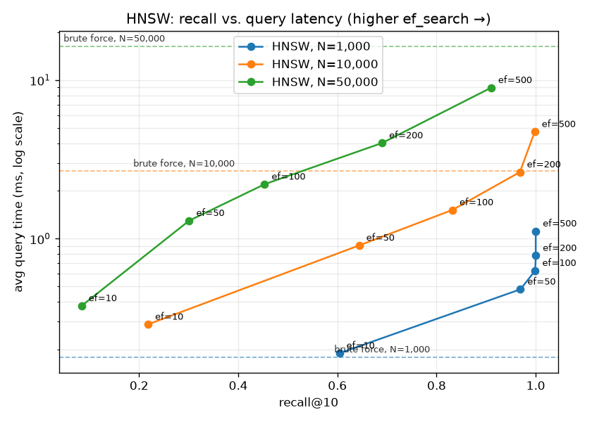

# vecsearch

A from-scratch implementation of **HNSW** (Hierarchical Navigable Small World)
graphs — the approximate-nearest-neighbour algorithm behind most production
vector databases — built up in readable steps, with an exact brute-force index
as the ground truth for measuring its accuracy.

```
brute force  →  single-layer NSW graph  →  hierarchical HNSW  →  benchmark
 (exact, slow)     (approximate)             (approximate, fast)   (proof)
```

## Why vector search matters

Modern AI systems represent text, images, and audio as **embeddings** —
high-dimensional vectors where "close" means "semantically similar". Retrieval
-augmented generation (RAG) works by embedding a user's question, finding the
handful of document chunks whose embeddings are nearest to it, and feeding
those chunks to an LLM as context. Recommendation, deduplication, and semantic
search work the same way.

The core operation is always: *given a query vector, find its k nearest
neighbours among millions or billions of stored vectors.* Doing that exactly
means comparing the query to every stored vector — linear in the dataset size,
far too slow at scale. **Approximate nearest neighbour (ANN)** search trades a
small amount of accuracy for orders-of-magnitude speedup.

HNSW is the ANN algorithm of choice: it is the default index in
[FAISS](https://github.com/facebookresearch/faiss), and it powers
[Pinecone](https://www.pinecone.io/), [Weaviate](https://weaviate.io/),
[Qdrant](https://qdrant.tech/), [Milvus](https://milvus.io/), and pgvector.
Understanding HNSW is understanding how production vector search works.

## The idea, in plain language

**Search a graph instead of scanning a list.** Store the vectors as nodes in a
graph where each node is linked to a few of its nearest neighbours. To answer a
query, start at some node, look at its neighbours, walk to whichever is closest
to the query, and repeat — a greedy hill-climb. You reach the query's
neighbourhood after visiting a tiny fraction of the nodes.

Plain greedy walks get stuck in local minima, so HNSW adds **layers**:

- **Layer 0** holds every vector, with short-range links — the fine-grained map.
- **Each layer above** is an exponentially thinned sample of the one below
  (roughly 1 in `m`), with longer-range links — the highway network.
- A new node is assigned a random top layer from an exponential distribution,
  so most nodes live only on layer 0 and a few reach the top.

A search **descends the hierarchy**: it takes big hops on the sparse top layer
to cross most of the space cheaply, drops down a layer, takes medium hops, and
so on, until it arrives at layer 0 already next to the answer and does one
careful local search there. This is the same intuition as a skip list, applied
to a proximity graph.

Two knobs control the accuracy/speed trade-off:

| knob | when | effect |
|------|------|--------|
| `ef_construction` | build time | width of the search beam while wiring up a new node — higher builds a better graph, more slowly |
| `ef_search` | query time | width of the beam at layer 0 — higher finds more true neighbours, more slowly |

### Neighbour selection heuristic

When connecting a node, picking its `m` closest candidates tends to bunch all
the links in one direction (toward the densest cluster), leaving "holes" the
greedy walk can't cross. `vecsearch` uses the **diversity heuristic** from the
HNSW paper instead: a candidate is kept only if it is closer to the new node
than to any neighbour already chosen. This spreads each node's links across
different directions and measurably improves recall (see `tests/test_hnsw.py`).

## What's in the box

| module | contents |
|--------|----------|
| `vecsearch/distance.py` | vectorized `cosine_distance`, `euclidean_distance` (single pair or batched) |
| `vecsearch/dataset.py` | `generate_random_vectors(n, dim, seed)` — random unit vectors |
| `vecsearch/brute_force.py` | `BruteForceIndex` — exact k-NN, the ground truth |
| `vecsearch/nsw.py` | `NSWGraph` — single-layer navigable small world graph |
| `vecsearch/hnsw.py` | `HNSWIndex` — the full hierarchical index |
| `vecsearch/persistence.py` | `save_index` / `load_index` (pickle) |
| `vecsearch/benchmark.py` | HNSW vs brute-force timing + recall table |
| `vecsearch/visualize.py` | recall-vs-latency Pareto chart |
| `vecsearch/cli.py` | `vecsearch build | query | benchmark` |

## Installation

```bash
git clone <repo> && cd vecsearch
python -m venv .venv && source .venv/bin/activate
pip install -e ".[dev]"      # or ".[viz]" for just the plotting extra
pytest                       # 27 tests
```

Requires Python 3.9+ and NumPy; `matplotlib` only for the chart.

## Library usage

```python
import numpy as np
from vecsearch import HNSWIndex, BruteForceIndex, generate_random_vectors

data = generate_random_vectors(n=50_000, dim=128, seed=42)

index = HNSWIndex(m=16, metric="cosine", seed=0)
for vec in data:
    index.insert(vec, ef_construction=100)

query = generate_random_vectors(1, 128, seed=1)[0]
ids, distances = index.search(query, k=10, ef_search=50)
```

## CLI usage

The `vecsearch` command is installed with the package.

```bash
# 1. build an index from an (n, dim) .npy matrix
vecsearch build vectors.npy --output index.pkl --m 16 --ef-construction 100

# 2. query it with a single length-dim .npy vector
vecsearch query index.pkl query.npy --k 5 --ef-search 50

# 3. run the benchmark
vecsearch benchmark --sizes 1000,10000 --dim 128
```

Full round trip (2 000 vectors of dim 64; the query is a lightly perturbed copy
of stored vector `123`):

```
$ vecsearch build vectors.npy --output index.pkl --m 16 --ef-construction 100
built HNSWIndex: 2000 vectors, dim=64, m=16, m0=32, max_level=2 -> index.pkl

$ vecsearch query index.pkl query.npy --k 5 --ef-search 50
top 5 of 2000 (ef_search=50):
rank        id      distance
   1       123      0.002673
   2       608      0.662469
   3      1343      0.664877
   4       407      0.679933
   5       453      0.680448
```

The index round-trips through pickle exactly — a loaded index returns identical
search results and can keep accepting inserts (`tests/test_persistence.py`).

## Benchmark

<!-- BENCHMARK:START -->
Random unit vectors, `dim=128`, `k=10`, 100 queries, `m=16`,
`ef_construction=100`. Pure-Python single thread on an Apple-silicon laptop.

**Build time** — brute force just stores the matrix; HNSW wires the graph.

| vectors | brute build | HNSW build |
|--------:|------------:|-----------:|
|   1 000 |      0.00 s |     0.69 s |
|  10 000 |      0.00 s |    36.4 s  |
|  50 000 |      0.00 s |   266 s    |

**Query** — average latency per query, and recall@10 vs. exact results.

| vectors | ef_search | recall@10 | HNSW / query | brute / query | speedup |
|--------:|----------:|----------:|-------------:|--------------:|--------:|
|   1 000 |        10 |     0.604 |     0.19 ms  |     0.18 ms   |   0.9x  |
|   1 000 |        50 |     0.969 |     0.48 ms  |     0.18 ms   |   0.4x  |
|   1 000 |       200 |     1.000 |     0.78 ms  |     0.18 ms   |   0.2x  |
|  10 000 |        10 |     0.218 |     0.29 ms  |     2.66 ms   |   9.2x  |
|  10 000 |        50 |     0.644 |     0.91 ms  |     2.66 ms   |   2.9x  |
|  10 000 |       200 |     0.968 |     2.63 ms  |     2.66 ms   |   1.0x  |
|  10 000 |       500 |     0.998 |     4.73 ms  |     2.66 ms   |   0.6x  |
|  50 000 |        10 |     0.084 |     0.38 ms  |    16.4 ms    |  43.5x  |
|  50 000 |        50 |     0.301 |     1.30 ms  |    16.4 ms    |  12.6x  |
|  50 000 |       100 |     0.453 |     2.21 ms  |    16.4 ms    |   7.4x  |
|  50 000 |       200 |     0.690 |     4.01 ms  |    16.4 ms    |   4.1x  |
|  50 000 |       500 |     0.910 |     8.96 ms  |    16.4 ms    |   1.8x  |

The story the table tells:

- **`ef_search` trades recall for latency, monotonically.** At 50 000 vectors,
  recall climbs 0.08 → 0.91 as `ef_search` goes 10 → 500, and query time rises
  with it (0.38 ms → 8.96 ms).
- **The speedup over brute force grows with the dataset.** At 1 000 vectors
  brute force is already sub-millisecond and HNSW's graph walk isn't worth it.
  At 50 000 vectors HNSW is **4x faster at recall 0.69**, and still 1.8x faster
  at recall 0.91 — and the gap widens with every additional order of magnitude,
  because brute force is linear in the dataset while HNSW is roughly
  logarithmic.

(Full grid including `ef_search` sweeps of `100` and `500` for every size is in
[`docs/benchmark.txt`](docs/benchmark.txt) / [`docs/benchmark.json`](docs/benchmark.json).)
<!-- BENCHMARK:END -->

Reproduce with:

```bash
python scripts/run_full_benchmark.py     # writes docs/benchmark.txt + docs/pareto.png
```

### Reading the chart



Each curve is one dataset size; points along it are increasing `ef_search`.
Up and to the right is more accurate; down is faster. The dashed line is
brute-force latency at that size — anything below it is a net win over exact
search. The knee of each curve is the `ef_search` worth using: past it you pay
linearly more time for diminishing recall gains. This is the standard way ANN
libraries report results (see [ann-benchmarks.com](http://ann-benchmarks.com/)).

> **Note on the data.** These benchmarks use random uniform vectors on the unit
> sphere, which is close to the *worst case* for ANN: in high dimensions every
> point is nearly equidistant from every other, so the greedy walk has little
> signal to follow. Real embeddings have far lower intrinsic dimensionality and
> HNSW does correspondingly better on them. The pure-Python build here is also
> unoptimised — production implementations are compiled and parallel.

## References

- Malkov & Yashunin, ["Efficient and robust approximate nearest neighbor search
  using Hierarchical Navigable Small World graphs"](https://arxiv.org/abs/1603.09320) (2016)
- [ann-benchmarks.com](http://ann-benchmarks.com/) — the standard ANN comparison suite
